<div align="center">

# MasjidOne

**One system for a masjid's madrasah and its congregation.**

Registers, fees and parent access on one side. Prayer times, a congregation
app, the website, the hall screens and donations on the other.
The same family, on both.

A product of **YSB Ventures Ltd**, Bolton.


</div>

---

## The problem, in one picture

A typical masjid runs its week across half a dozen things that have never
heard of each other. The office knows a family three separate times and
can join them up only by remembering.



Plenty of products do the congregation side, and do it well. The part
nobody else does is running the **madrasah's daily operations** — the
register marked each evening, the sabaq heard, the fee due — in the same
system, and then giving a parent a view of their own child.

---

## The four surfaces

Every masjid on MasjidOne gets the same four things. Same layout, their
colours, their domain.



> **The madrasah portal and parent access are not built yet.** They are
> tagged "in development" here, on the website and in the console, and
> they stay tagged until they are real.

---

## How the pieces actually fit

This is the technical picture. **This repository is only the top-left box** —
the marketing website. The platform lives in its own repository.



### Why one database and not one per masjid

Every table carries a `masjid_id`. Every function and every security
policy filters on it, and a person can only ever act for one masjid at a
time.



A database each would mean a separate migration, a separate set of keys
and a separate auth setup for every customer — and the whole point of the
product, one record of one family reachable from both sides, happens
*inside* a masjid rather than between them. Separation buys nothing there
and costs a great deal to run.

---

## This repository

The marketing site. Its job is to give a masjid committee somewhere to
land after a conversation, look at what they would be buying, and ask for
a demo. It is not a self-serve signup — nobody buys this without a
meeting.

```bash
npm install
npm run dev     # http://localhost:3000
npm run build   # static export to out/
```

**Next.js 15 (App Router) · TypeScript · Tailwind · shadcn/ui.**
`output: 'export'` writes plain HTML, CSS and JS to `out/`, so there is
nothing to run at request time and nothing to keep patched.

### Deploying

GitHub Actions builds and publishes to Pages
(`.github/workflows/deploy.yml`). Pages cannot build a Next app from a
branch, so **Settings → Pages → Source** must be **GitHub Actions**.

| Setting | When | Value |
| --- | --- | --- |
| `NEXT_PUBLIC_BASE_PATH` | Served from `<user>.github.io/MasjidOne` | `/MasjidOne` |
| `NEXT_PUBLIC_BASE_PATH` | Custom domain | leave unset, add `CNAME` to `public/` |
| `NEXT_PUBLIC_SITE_URL` | Custom domain | the full origin |

Getting the base path wrong 404s every asset on the page.

### Where things live

| What you want to change | File |
| --- | --- |
| Plans and prices | `components/masjidone-pricing.tsx` |
| The pricing block itself | `components/ui/pricing.tsx` |
| Every other section | `components/site-sections.tsx` |
| Behaviour for those sections | `components/site-behaviour.tsx` |
| Colour, type and spacing | `app/globals.css` |
| Canonical URL, contact address | `lib/site.ts` |
| The full design system | `DESIGN.md` |

---

## What it costs

| | |
| --- | --- |
| **Madrasah** | £79 / month |
| **Masjid Complete** | £179 / month |
| Setup | £499 once — waived on twelve months prepaid |
| Donations | 0% commission |

Yearly billing is the same rate shown twelve times over, not a discount.
Only the setup fee falls.

---

## Before you change any copy

Read **`CLAUDE.md`** first. The prices, the competitive claim and the
"in development" tags are commercial commitments, not wording choices.
Three that catch people out:

- **Never claim a feature that is not built.** The madrasah portal and
  parent access are in development.
- **Never say no competitor does the whole masjid.** Several do the
  congregation side. The defensible claim is narrower and it is written
  down in `CLAUDE.md`.
- **Compliance is a commitment, not a fact.** ICO registration and the
  data processing agreement are promised *before a masjid is invoiced*.
  Do not rewrite them into the present tense until they are done.

British English throughout, and Arabic terms keep their diacritics:
jamāʿah, Jumuʿah, janāzah, nikāḥ, Hifz, sadaqah, madrasah, masjid.

---

## The diagrams

They are SVGs, and the connectors animate — the same travelling-beam idea the
site uses on its modules diagram. GitHub renders mermaid but cannot animate it,
so these are built rather than inlined.

The sources stay in the repo as text, so a diagram is still something you can
edit and diff rather than a picture nobody can change:

```bash
assets/diagrams/*.mmd          # the source, one file per diagram
node scripts/build-diagrams.mjs # regenerates the SVGs
```

The build script holds the palette and the animation in one place. It declares
the colours light-first and redefines them under `prefers-color-scheme`, so the
diagrams follow GitHub's theme, and it keeps a `prefers-reduced-motion` guard —
anybody who has asked their machine for less movement gets a still picture.

---

## Licence

All rights reserved. Not open source.
