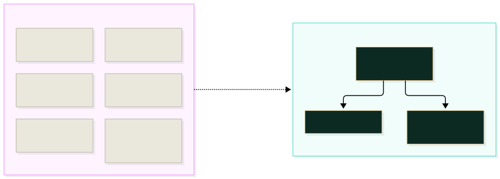
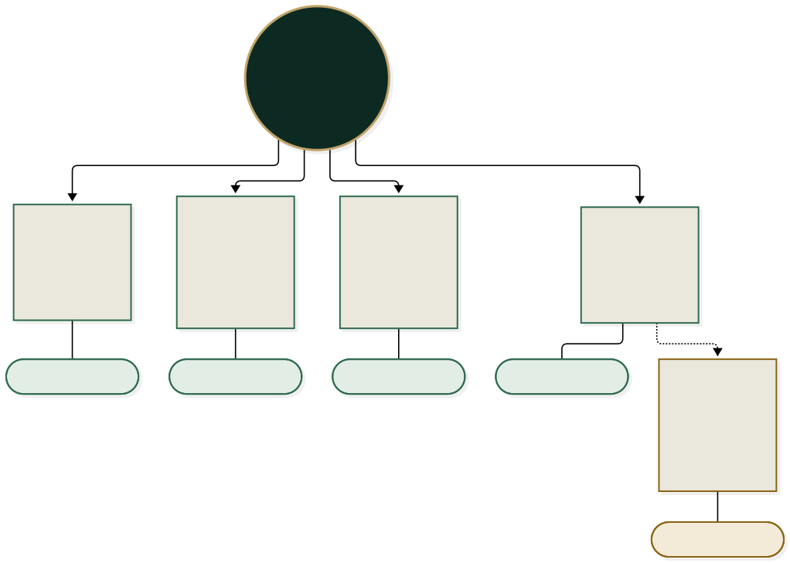
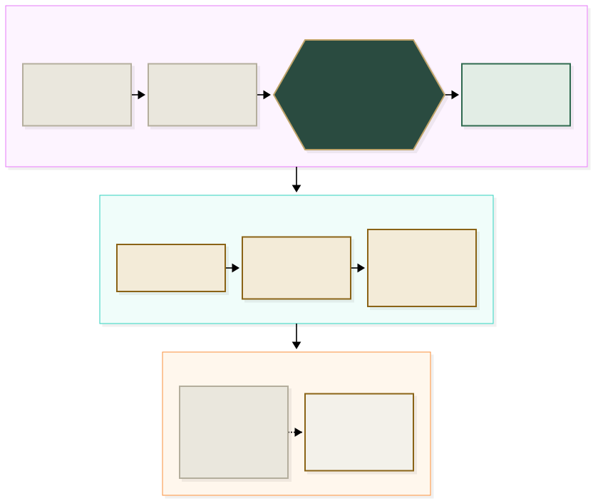
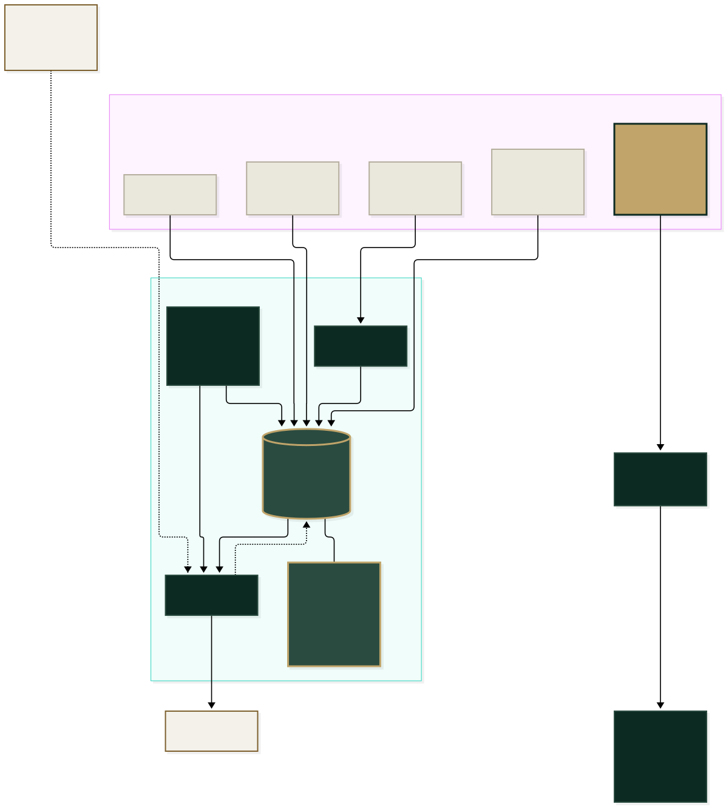
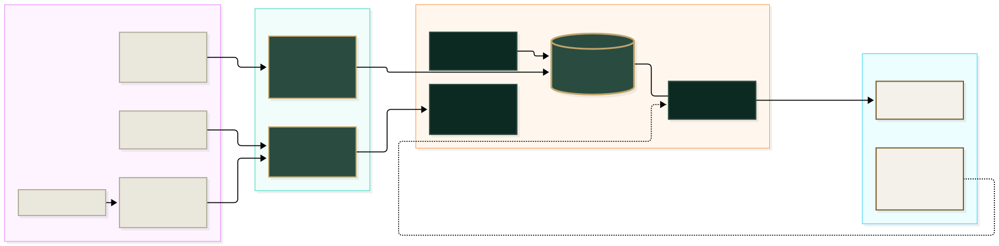
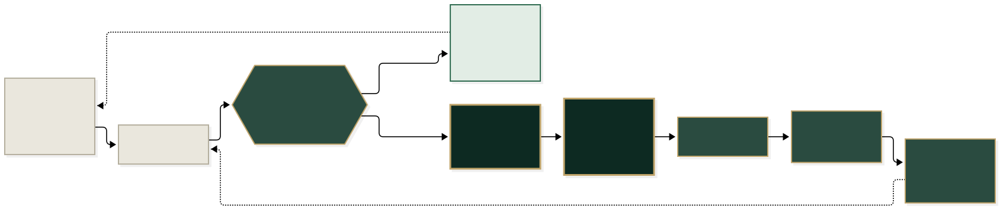

<div align="center">

# MasjidOne

**One system for a masjid's madrasah and its congregation.**

Registers, fees and parent access on one side. Prayer times, a congregation
app, the website, the hall screens and donations on the other.
The same family, on both.

Built in Bolton, for masājid across the UK.


</div>

<br/>

> [!NOTE]
> **Reading this without a technical background?** Start at *The problem*, *The
> four surfaces* and *One evening, end to end*. Those three explain what
> MasjidOne is and what it does for a masjid. Everything after *How the pieces
> fit* is for whoever maintains the code.

### How to read the diagrams

Every picture in this file uses the same four colours, and they always mean the
same thing. The connectors animate, so you can see which way the information
actually travels.

| | Means |
| :--- | :--- |
| ⬛ **Deep green, brass border** | MasjidOne itself — our code, our database |
| 🟩 **Pale green** | Live, working, in a masjid today |
| 🟨 **Sand, dashed border** | In development — not built, not sold as built |
| ⬜ **Stone** | A person, or something outside the system |

---

## The problem, in one picture

A typical masjid runs its week across half a dozen things that have never
heard of each other. The office knows a family three separate times and
can join them up only by remembering.



Plenty of products do the congregation side, and do it well. The part
nobody else does is running the **madrasah's daily operations** — the
register marked each evening, the sabaq heard, the fee due — in the same
system, and then giving a parent a view of their own child.

---

## The four surfaces

Every masjid on MasjidOne gets the same four things. Same layout, their
colours, their domain.



> [!IMPORTANT]
> **The madrasah portal is built. Parent access is not.** The portal holds a
> masjid's roll, classes, staff and households, with registers and fees
> configured. What is still in development is *parent access* — the half a
> parent sees — and *Hifz and sabaq progress*. Those two are tagged "in
> development" here, on the website and in the console, and they stay tagged
> until they are real.
>
> This paragraph said all three were unbuilt until October 2026, which was
> wrong and had been wrong for a while. Before you change a status claim
> anywhere, **check the database** — see the warning below.

---

## One evening, end to end

The clearest way to explain the product is to follow a single Tuesday. A teacher
marks a register at six; by Wednesday morning the office knows which class
*didn't*; and the child in that register is the same record the congregation
side already holds.



> [!TIP]
> **The dashed sand box is the whole business.** Everything to the left of it is
> a madrasah system; plenty of those exist. The parent seeing their own child in
> the app they already use for prayer times is the part nobody else does — and
> it is the part still in development.

---

## How the pieces actually fit

This is the technical picture. **This repository is only the top-left box** —
the marketing website. The platform lives in its own repository.



### Why one database and not one per masjid

Every table carries a `masjid_id`. Every function and every security
policy filters on it, and a person can only ever act for one masjid at a
time.


A database each would mean a separate migration, a separate set of keys
and a separate auth setup for every customer — and the whole point of the
product, one record of one family reachable from both sides, happens
*inside* a masjid rather than between them. Separation buys nothing there
and costs a great deal to run.

---

## The stack, in four layers

Left to right: what gets written, what it compiles to, where that runs, and the
two outside services it talks to.



| Layer | What and why |
| :--- | :--- |
| **TypeScript 5.7** | Every file. A mosque's fee ledger is not a place for `undefined` |
| **Next.js 15** · React 18.3 | App Router, static export — no server at request time |
| **Tailwind 3.4** + shadcn/ui | Driven by MasjidOne's own tokens, not Tailwind's defaults |
| **Postgres 17** on Supabase | One database. Every table carries `masjid_id` |
| **Row Level Security** | The database refuses the wrong rows; it is not an `if` statement in the app |
| **Deno edge functions** | Notifications and webhooks |
| **React Native · Expo** | The congregation app, iOS and Android |
| **Stripe** | The masjid's own account. We never touch the money |
| **OneSignal** | Push, scoped per masjid |
| **GitHub Actions → Pages** | Builds and publishes. Nothing to patch at 2am |

> [!IMPORTANT]
> **`output: 'export'` is a constraint, not a preference.** The marketing site
> compiles to plain files on a CDN. Adding anything that needs a Node server at
> request time breaks the deploy — and removes the main reason this site cannot
> go down.

---

## This repository

The marketing site. Its job is to give a masjid committee somewhere to
land after a conversation, look at what they would be buying, and ask for
a demo. It is not a self-serve signup — nobody buys this without a
meeting.

```bash
npm install
npm run dev     # http://localhost:3000
npm run build   # static export to out/
```

**Next.js 15 (App Router) · TypeScript · Tailwind · shadcn/ui.**
`output: 'export'` writes plain HTML, CSS and JS to `out/`, so there is
nothing to run at request time and nothing to keep patched.

> [!WARNING]
> **`CONTACT_EMAIL` in `lib/site.ts` is still `REPLACE-ME@masjidone.example`.**
> It is one line, and until it is set every "Request a demo" on the site — and
> the subject access route in the privacy policy — goes nowhere.

### Deploying

GitHub Actions builds and publishes to Pages
(`.github/workflows/deploy.yml`). Pages cannot build a Next app from a
branch, so **Settings → Pages → Source** must be **GitHub Actions**.

> [!CAUTION]
> **`public/CNAME` decides the URLs.** If it holds a domain, the base path is
> empty and the canonical origin is that domain — `next.config.mjs` reads the
> file and ignores a stale `NEXT_PUBLIC_BASE_PATH` rather than obeying it. This
> is not a preference: the live site once shipped with **every asset 404ing**
> because the variable still said `/MasjidOne` while the custom domain served
> from the root.

| Variable | When you need it | Value |
| --- | --- | --- |
| `NEXT_PUBLIC_BASE_PATH` | Only with **no** `public/CNAME`, served from `<user>.github.io/MasjidOne` | `/MasjidOne` |
| `NEXT_PUBLIC_SITE_URL` | Only with **no** `public/CNAME` | the full origin |
| `NEXT_PUBLIC_COMMIT_DATE` | Set by the workflow | the last commit date, for `sitemap.xml` |
| `GOOGLE_SITE_VERIFICATION` | Only for a Search Console **URL-prefix** property | the token |

A Search Console *Domain* property is verified by DNS at the registrar and
needs none of this.

### What the site is

Eight indexable pages, plus a demonstration tenant that is deliberately not
indexed.

| Route | What it is |
| --- | --- |
| `/` | The argument: the join, the modules, the previews, the prices |
| `/madrasah-software/` | Registers, fees, families |
| `/mosque-prayer-times-screens/` | One timetable, every screen |
| `/mosque-app/` | Times, reminders, notices, giving |
| `/mosque-website/` | The managed website |
| `/mosque-donations/` | 0% commission and Gift Aid |
| `/privacy/`, `/terms/` | Legal |
| `/demo/` | The demonstration tenant — `noindex`, and disallowed in `robots.txt` |

The five module pages exist because one URL cannot rank for more than one
intent. Each declares **its own** canonical and `openGraph.url`: the root
layout deliberately sets neither, because a default there is inherited, and
`/privacy/` once told Google it was a duplicate of the home page. Next does not
derive `og:url` from a canonical, and it *replaces* `openGraph` rather than
merging it — so every page builds its whole block from `openGraphFor()` in
`lib/site.ts` or it silently loses the card image.

### The demonstration tenant

`/demo/` is a sales walkthrough built from invented data in `lib/demo-data.ts`.
There is no database behind it and the sign-in is a string comparison in the
browser, which is why the credentials are printed on the screen — a login box
on a public URL that appears to guard something real, but does not, is a
credential-harvesting shape.

```
/demo/                          sign in with demo / demo
/demo/?masjid=Masjid+e+Taqwa    the committee sees their own name
/demo/#office                   open straight on a screen, mid-call
```

Navigation is the URL, not component state. Each screen has a hash and the
stage is derived from it, so the browser's back button — and the phone's back
gesture, which matters more — work. An earlier attempt used `history.state`;
Next's App Router owns `popstate` and remounts the page, which made one Back
jump three screens.

The scale is deliberately **not** the real customer's, so a screenshot of the
demo can never be mistaken for their data. Imagery rules live in
`public/devices/README.md`: nothing in that folder is a screenshot, and no real
child's record or family's fee history is ever published.

### Where things live

| What you want to change | File |
| --- | --- |
| The three prices | `lib/site.ts` — one source; the yearly total is `price * 12`, derived, so it cannot drift into a discount |
| Plan features and copy | `components/masjidone-pricing.tsx` |
| The pricing block itself | `components/ui/pricing.tsx` |
| Every other home page section | `components/site-sections.tsx` |
| Behaviour for those sections | `components/site-behaviour.tsx` |
| A module page's content | `app/<slug>/page.tsx` — data only |
| The module page layout | `components/module-page.tsx` |
| The demo's screens | `components/demo-*.tsx` |
| The demo's data | `lib/demo-data.ts` |
| What Google reads | `components/structured-data.tsx` |
| Canonical URL, contact address | `lib/site.ts` |
| Colour, type and spacing | `app/globals.css` |
| The full design system | `DESIGN.md` |
| The rules that are not wording choices | `CLAUDE.md` |

---

## When something goes wrong

Most things a masjid wants changed are not faults at all — they are the masjid's
own content, and the masjid changes them itself without asking anybody. The
small remainder comes to us, and a fix reaches every masjid rather than only the
one that reported it.



### Who fixes what

| It is… | Who | How long |
| :--- | :--- | :--- |
| A wrong jamāʿah time, a notice, a fee rate, who has access | **The masjid**, in the portal | Immediately |
| A pupil in the wrong class, a family to merge | **The masjid**, in the portal | Immediately |
| A screen showing the wrong thing, a button that does nothing | **MasjidOne** | Reproduced against your own configuration |
| Anything touching a child's record or money | **MasjidOne**, treated as urgent | Ahead of everything else |

> [!IMPORTANT]
> **A masjid never waits on us for its own content.** If the office has to open a
> ticket to change Maghrib, the product has failed. Everything a committee
> routinely needs to change is theirs to change, which is also why role-based
> access matters: the person who should change it can, and nobody else can.

> [!WARNING]
> **The support address is not live yet.** `CONTACT_EMAIL` in `lib/site.ts` is
> still `REPLACE-ME@masjidone.example`, so the route in this diagram does not
> currently exist. Until it is set, the "log a ticket" link, every "request a
> demo" button and the subject access route in the privacy policy all go
> nowhere.

There is no overseas support desk and no outsourced queue. A masjid talks to
the **MasjidOne support team** — the people who wrote the system and can fix it.

---

## What it costs

| | |
| --- | --- |
| **Madrasah** | £79 / month |
| **Masjid Complete** | £179 / month |
| Setup | £499 once — waived on twelve months prepaid |
| Donations | 0% commission |

Yearly billing is the same rate shown twelve times over, not a discount.
Only the setup fee falls.

---

## Before you change any copy

> [!CAUTION]
> Read **`CLAUDE.md`** first. The prices, the competitive claim and the
> "in development" tags are **commercial commitments, not wording choices**. A
> wrong one loses a sale and the referral behind it.

Three that catch people out:

- **Never claim a feature that is not built, and never deny one that is.**
  Parent access and Hifz/sabaq progress are in development; the madrasah
  portal is not. Both halves of that rule have been broken here — the site
  spent months telling committees the portal was not ready while badging it
  Live two sections further up. `CLAUDE.md` records what was true on the day
  it was written, so **query the database rather than trusting either
  document**, including this one.
- **Never say no competitor does the whole masjid.** Several do the
  congregation side. The defensible claim is narrower and it is written
  down in `CLAUDE.md`.
- **Compliance is a commitment, not a fact.** ICO registration and the
  data processing agreement are promised *before a masjid is invoiced*.
  Do not rewrite them into the present tense until they are done.

British English throughout, and Arabic terms keep their diacritics:
jamāʿah, Jumuʿah, janāzah, nikāḥ, Hifz, sadaqah, madrasah, masjid.

---

## The diagrams

Seven SVGs, and the connectors animate — the same travelling-beam idea the site
uses on its modules diagram. GitHub renders mermaid but cannot animate it, so
these are built rather than inlined.

The sources stay in the repo as text, so a diagram is still something you can
edit and diff rather than a picture nobody can change:

```bash
assets/diagrams/*.mmd          # the source, one file per diagram
node scripts/build-diagrams.mjs # regenerates the SVGs
```

The build script holds the palette and the animation in one place. It declares
the colours light-first and redefines them under `prefers-color-scheme`, so the
diagrams follow GitHub's theme, and it keeps a `prefers-reduced-motion` guard —
anybody who has asked their machine for less movement gets a still picture.

> [!NOTE]
> **Do not add a `font-family` override to that stylesheet.** Mermaid measures
> every label and sizes each box *before* the stylesheet is appended, so
> changing the face afterwards reflows text inside boxes built for a different
> font and silently clips the last line. It went unnoticed until a diagram had
> narrow nodes. Mermaid embeds the face it measured with — leave it alone.

Rendering needs a Chromium. If the machine has one already:

```bash
PUPPETEER_EXECUTABLE_PATH=/path/to/chrome node scripts/build-diagrams.mjs
```

---

## Licence

All rights reserved. Not open source.
